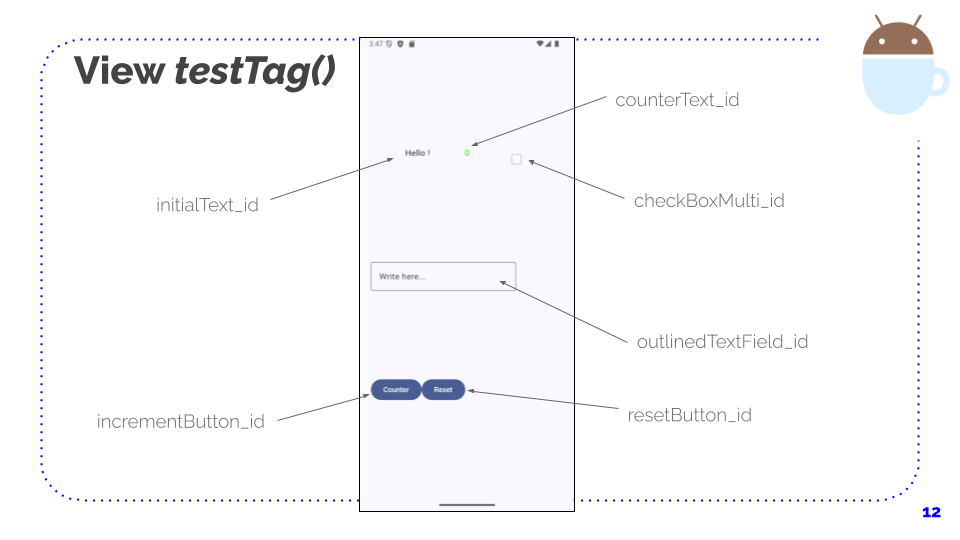

# Android HelloWOrld App for unit cases testing and UI instrumental testing
## Android Studio Version
Android Studio Ladybug Feature Drop | 2024.2.2

## Language
Kotlin with JetPack Compose

## Purpose
This purpose of the **main** branch is a demo of unit cases testing and UI instrumental testing with JUnit4 for the Unit Testing over the ViewModel and Espresso for the Instrumental UI.

---

# Gradle dependencies
If you want to expand the current project and include MVVM pattern, which is already in place through the packages, it is necessary to add the following dependencies in the file [`app/build.gradle.kts`](app/build.gradle.kts):

``` bash
dependencies {
    // Plataforma de versions Compose
    implementation(platform("androidx.compose:compose-bom:2024.04.01"))
    implementation(platform(libs.androidx.compose.bom))
    androidTestImplementation(platform(libs.androidx.compose.bom))

    // ────────────────────────────────
    // Unit Testing (JVM)
    // ────────────────────────────────
    testImplementation("androidx.arch.core:core-testing:2.2.0")
    testImplementation(libs.junit)

    // ────────────────────────────────
    // Instrumental UI Testing (emulador/dispositiu)
    // ────────────────────────────────
    androidTestImplementation("androidx.test.espresso:espresso-core")
    androidTestImplementation("androidx.test.ext:junit")
    androidTestImplementation("androidx.compose.ui:ui-test-junit4")
    androidTestImplementation(libs.androidx.espresso.core)
    androidTestImplementation(libs.androidx.junit)
    androidTestImplementation(libs.androidx.ui.test.junit4)

    // ────────────────────────────────
    // Debug Tools (només en debug)
    // ────────────────────────────────
    debugImplementation("androidx.compose.ui:ui-tooling")
    debugImplementation("androidx.compose.ui:ui-test-manifest")
    debugImplementation(libs.androidx.ui.tooling)
    debugImplementation(libs.androidx.ui.test.manifest)

    // ────────────────────────────────
    // Implementació principal de l'app
    // ────────────────────────────────
    implementation("androidx.compose.runtime:runtime-livedata")
    implementation("androidx.compose.material3:material3")
    implementation("androidx.compose.ui:ui")
    implementation("androidx.lifecycle:lifecycle-runtime-ktx")
    implementation("androidx.activity:activity-compose")

    implementation(libs.androidx.core.ktx)
    implementation(libs.androidx.lifecycle.runtime.ktx)
    implementation(libs.androidx.activity.compose)
    implementation(libs.androidx.ui)
    implementation(libs.androidx.ui.graphics)
    implementation(libs.androidx.ui.tooling.preview)
    implementation(libs.androidx.material3)
}
```

# Screenshot
## MyView testTags():

